# Module 1: Migrating Windows & SQL Server workloads

Duration: 60 minutes

In this Module, you will use Azure Migrate: Server Assessment to assess the on-premises environment. This will include selecting Azure Migrate tools, deploying the Azure Migrate appliance into the on-premises environment, creating a migration assessment, and using the Azure Migrate dependency visualization.

### Exercise 1: Discovery, Assess, and Plan: Evaluate your current environment

In this exercise, you will deploy the Azure Migrate appliance in the on-premises Hyper-V environment. This appliance communicates with the Hyper-V server to gather configuration and performance data about your on-premises VMs, and returns that data to your Azure Migrate project.

1. If you are not logged in already, click on Azure portal shortcut that is available on the desktop and log in with below Azure credentials.
    * Azure Username/Email: <inject key="AzureAdUserEmail"></inject> 
    * Azure Password: <inject key="AzureAdUserPassword"></inject>

2. Click on **Show Portal Menu (1)** bar and select **All services (2)** in the portal's left navigation.
 
    

3. In the search bar, search for **Azure Migrate** and select it from the suggestions to open the Azure Migrate Overview blade, as shown below. 
 
    

4. Under **Azure Migrate: Discovery and assessment**, select **Discover** to open the **Discover** blade.
 
    
 
5. Under **Are your machines virtualized?**, select **Yes, with Hyper-V** from the **drop-down** menu.

    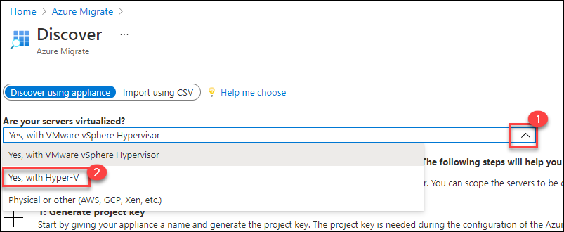

6.  In **1: Generate Azure Migrate project key**, provide below name for the **Azure Migrate appliance** that you will set up for discovery of Hyper-V VMs. Select **Generate key** to start the creation of the required Azure resources.

     ```
     SmartHotelAppl
     ```
    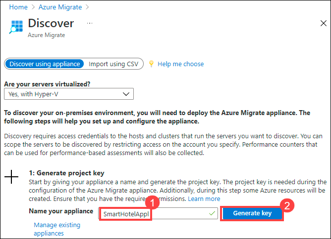

7.  **Wait** for the key to be generated, then copy the **Azure Migrate project key** to your clipboard.

    

8.  Read through the instructions on how to download, deploy and configure the Azure Migrate appliance then close the 'Discover machines' blade by clicking on cross button **X** (do **not** download the .VHD file or .ZIP file, the .VHD has already been downloaded for you). 
 
    

9. Go to **Start** button in the VM, search for **Hyper-V Manager** there and select it. 

   > You can also open the **Hyper-v manager** by clicking on the icon that is present in the taskbar. 

     

10. In Hyper-V Manager, select **SMARTHOST<inject key="DeploymentID" enableCopy="false" />**. You should now see the AzureMigrateAppliance VM and four VMs that comprise the on-premises SmartHotel application.

     


### Exercise 2: Set up your environment on Azure to migrate servers 

#### Task 1: Add assessment and migration tools to Azure migrate project 


### Task 2: Create a migration assessment

In this task, you will use Azure Migrate to create a migration assessment for the SmartHotel application, using the data gathered during the discovery phase.

1. Select **Assess** under **Azure Migrate: Discovery and assessment** and click on **Azure VM** to start a new migration assessment.

   

2. On the Assess servers blade, ensure the Assessment type to be **Azure VM** and Discovery Source to be **Servers discovered from Migrate Appliance**. Under **Assessment settings**, select **Edit**.

   

3. The **Assessment settings** blade allows you to tailor many of the settings used when making a migration assessment report. Take a few moments to explore the wide range of assessment properties. Hover over the information icons to see more details on each setting. Choose any settings you like, then select **Save**. (You have to make a change for the Save button to be enabled; if you don't want to make any changes, just close the blade.)

   

4. Select **Next** to move to the **Select servers to assess** tab and enter the following information:
     
     1. Assessment name: Enter **SmartHotelAssessment** 
     1. Select or create a group: Choose **Create New** and enter the 
     1. Group name: Enter **SmartHotel VMs**.
     1. Add machines to the Group:  Select **SmarthotelAppl** from dropdown.
     1. Select the **smarthotelweb1**, **smarthotelweb2** and **UbuntuWAF** VMs and
     1.  Click on **Next**.

   

    **Note:** There is no need to include the **smarthotelSQL1** or **AzureMigrateAppliance** VMs in the assessment, since they will not be migrated to Azure. (The SQL Server will be migrated to the SQL Database service and the Azure Migrate Appliance is only used for migration assessment.)

5. Click on **Create assessment** to create the assessment. 

   

6. On the **Servers, databases and web apps** blade, select **Refresh** periodically until the number of assessments shown is **1** (This may take few minutes). Once the assessments count is updated, click on **1** that is next to **Total** under **Assessments**.  

    ")
    
7. Select **Assessments** under **Azure Migrate: Discovery and assessment** to see a list of assessments. Then select the actual assessment.

   ")

8. Take a moment to study the assessment overview and select **Settings**..

   

9. Note how you can now modify the assessment properties you choose earlier. Change a selection of settings, and **Save** your changes. After a few moments, the assessment report will update to reflect your changes.

10. Select **Azure readiness** (either the chart or on the left navigation). Note that for the **UbuntuWAF** VM, a specific concern is listed regarding the readiness of the VM for migration.

    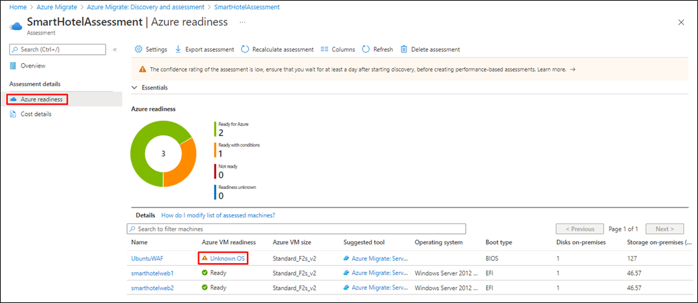

11. Select **Unknown OS** for **UbuntuWAF**. A new browser tab opens showing Azure Migrate documentation. Note on the page that the issue relates the OS not being specified in the host hypervisor, so you must confirm the OS type and version is supported.

12. Return to the portal browser tab and select **UbuntuWAF** VM to view details of the issue. Note the recommendation to migrate the VM using **Azure Migrate: Server Migration**.

### Task 3: Configure dependency visualization

When migrating a workload to Azure, it is important to understand all workload dependencies. A broken dependency could mean that the application doesn't run properly in Azure, perhaps in hard-to-detect ways. Some dependencies, such as those between application tiers, are obvious. Other dependencies, such as DNS lookups, Kerberos ticket validation or certificate revocation checks, are not.

In this task, you will configure the Azure Migrate dependency visualization feature. This requires you to first create a Log Analytics workspace, and then to deploy agents on the to-be-migrated VMs.

1. Return to the **Azure Migrate** blade in the Azure Portal, select **Servers, databases and web apps (1)**. Under **Discovery and assessment** select **Groups (2)**,

       

2. Select the **SmartHotel VMs** group to see the group details. 

   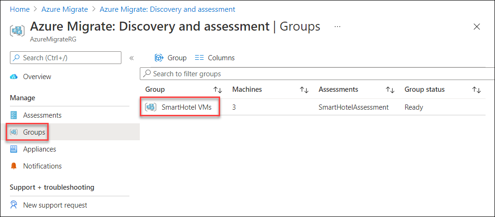   

3. Note that each VM has their **Dependencies** status as **Requires agent installation**. Select **Requires agent installation** for the **smarthotelweb1** VM.

   

4. On the **Dependencies** blade, select **Configure Log Analytics workspace**.

   

5. On the **Configure Log Analytics workspace** blade, provide the below information and select **Configure**.

   - Log Analytics workspace: Click on **Create new** and enter **AzureMigrateWS<inject key="DeploymentID" enableCopy="false" />**
   - Log Analytics workspace location: Select **East US** from the dropdown.

  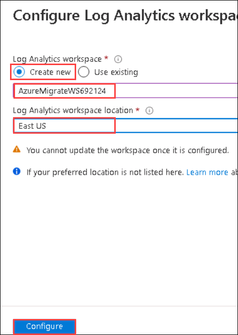

6. Wait for the workspace to be deployed. Once it is deployed, navigate to **AzureMigrateWS<inject key="DeploymentID" enableCopy="false" />** by clicking on it.

   

7. Select **Agents management** under **Settings** from the left hand side menu. Make a note of the **Workspace ID** and **Primary Key** (for example by using Notepad).

   

8. Return to the Azure Migrate **Dependencies** blade. Copy each of the 4 agent download URLs and paste them alongside the Workspace ID and key you noted in the previous step. 
   
   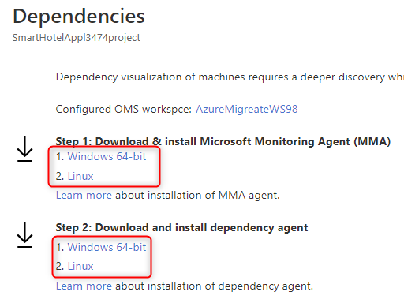

9. From **Hyper-V Manager** console, select **smarthotelweb1** and select **Connect**.

   

10. Select **Connect** again when prompted and log in to the **Administrator** account using the password **<inject key="SmartHotelHost Admin Password" />**.

11. Go to **Start** button in the **smarthotelweb1** VM and select **Internet Explorer** to open it. Paste the link to the 64-bit Microsoft Monitoring Agent for Windows, which you noted earlier. When prompted, **Run** the installer.

    > **Note:** You may need to disable **Internet Explorer Enhanced Security Configuration** on **Server Manager** under **Local Server** to complete the download. 

    

12. On the **Welcome to the Microsoft Monitoring Agent Setup Wizard** blade, select **Next**. 

    

13. On the **Microsoft Software License Terms** blade, select **I Agree** 

    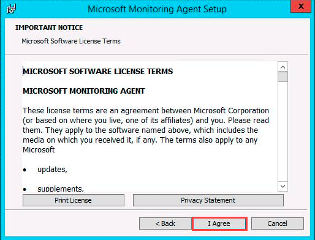

14. On the **Destination Folder** blade, leave everything as default and select **Next**. 

     

15. On the **Agent Setup Options** blade, select **Connect the agent to Azure Log Analytics (OMS)** and select **Next**.

    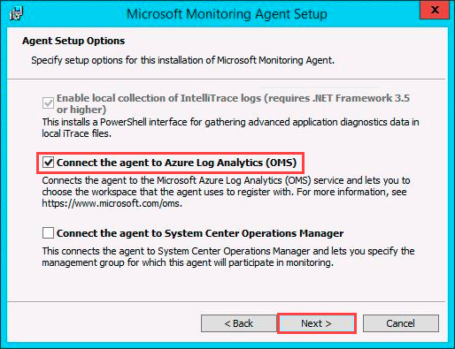 

16. On the **Azure Log Analytics** blade, enter the Workspace ID and Workspace Key that you copied earlier, and select **Azure Commercial** from the Azure Cloud drop-down then select **Next**.

    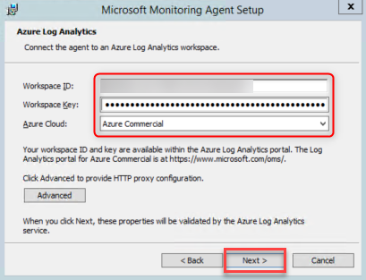

17. On the **Microsoft Update** blade, leave everything as default and select **Next**. 

    

18. On the **Ready to Install** blade, click on **Install**. 

    

19. Select **Finish** to finish the installation process of **Microsoft Monitoring Agent for Windows**.

    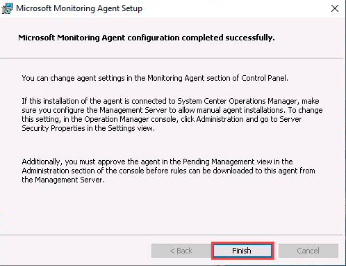

20. Paste the link to the Dependency Agent Windows installer into the browser address bar. **Run** the installer.

    

21. On the **License Agreement** blade, select **I Agree** to accept the agreement and continue. 

    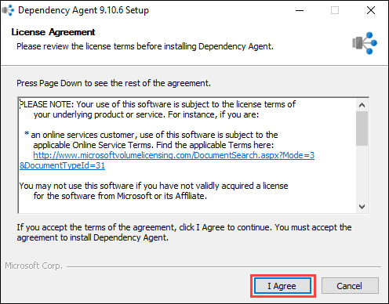 

22. On the **Completing Dependency Agent Setup** blade, select **Finish** to finish the installation process.

    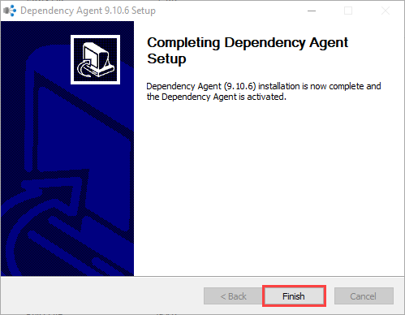 
 

   > **Note:** You do not need to configure the workspace ID and key when installing the Dependency Agent, since it uses the same settings as the Microsoft Monitoring Agent, which must be installed beforehand.

23. Return to the Azure Portal and refresh the Azure Migrate **SmartHotel VMs** VM group blade. The 3 VMs on which the dependency agent was installed should now show their status as **Installed**. (If not, refresh the page **using the browser refresh button**, not the refresh button in the blade.  It may take up to **5 minutes** after installation for the status to be updated.)

   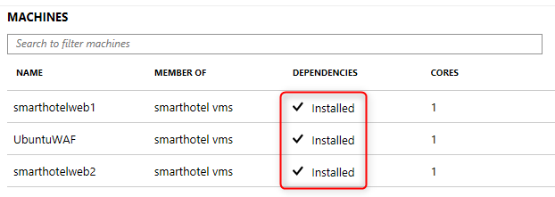
   
   >**Note**: If you notice that the dependency agent status is showing as **Requires Agent Installation** instead of Installed even after installing dependency agents in all the three VMs, please follow the steps from [here](https://github.com/CloudLabsAI-Azure/Know-Before-You-Go/blob/main/AIW-KBYG/AIW-Infrastructure-Migration.md#4-exercise1---task6---step1) to confirm dependency agent installation in VMs using Log Analytics workspace.
 
24. Select **View dependencies**.

   
   
25. Take a few minutes to explore the dependencies view. Expand each server to show the processes running on that server. Select a process to see process information. See which connections each server makes.

    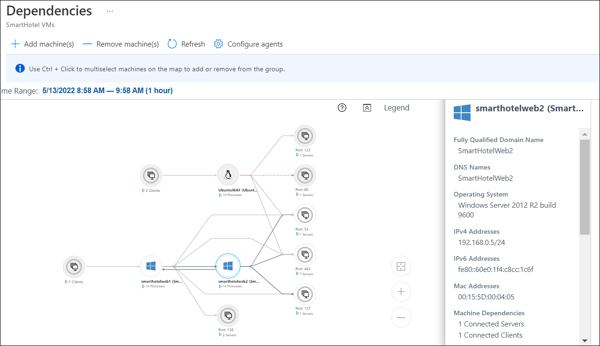
    
