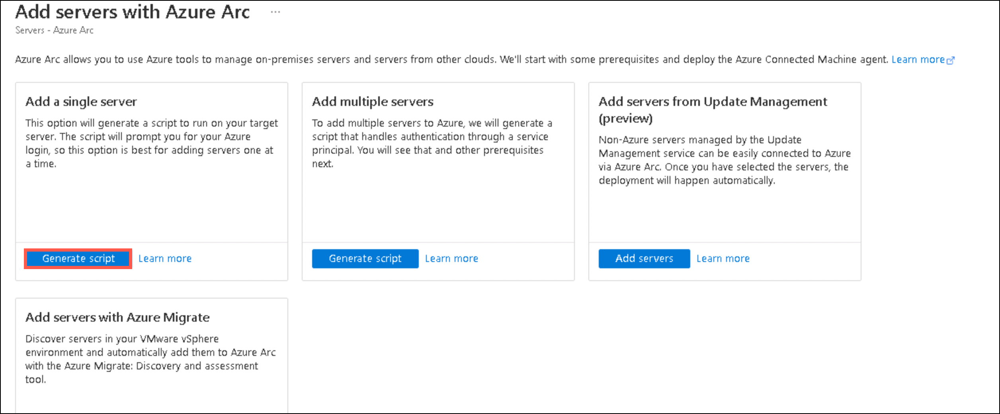
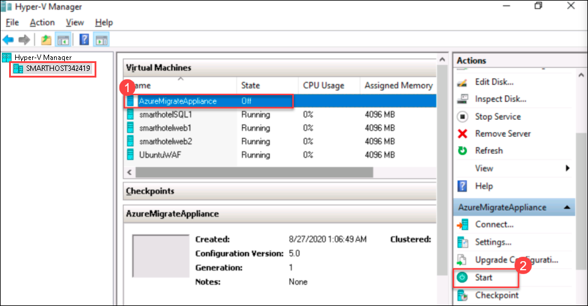
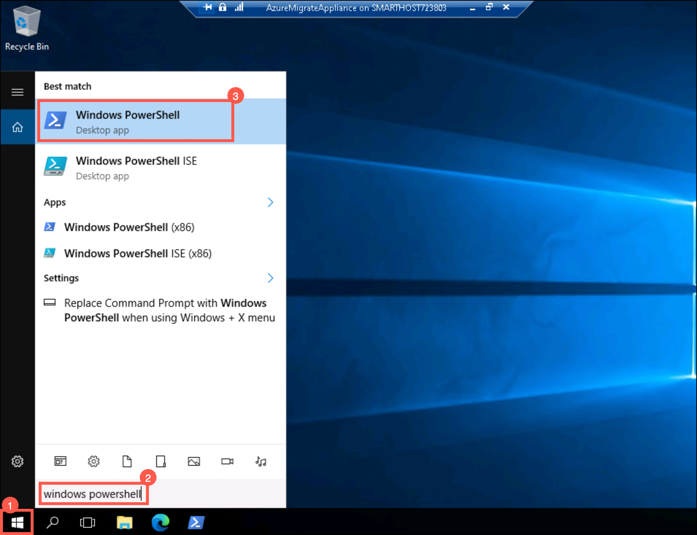
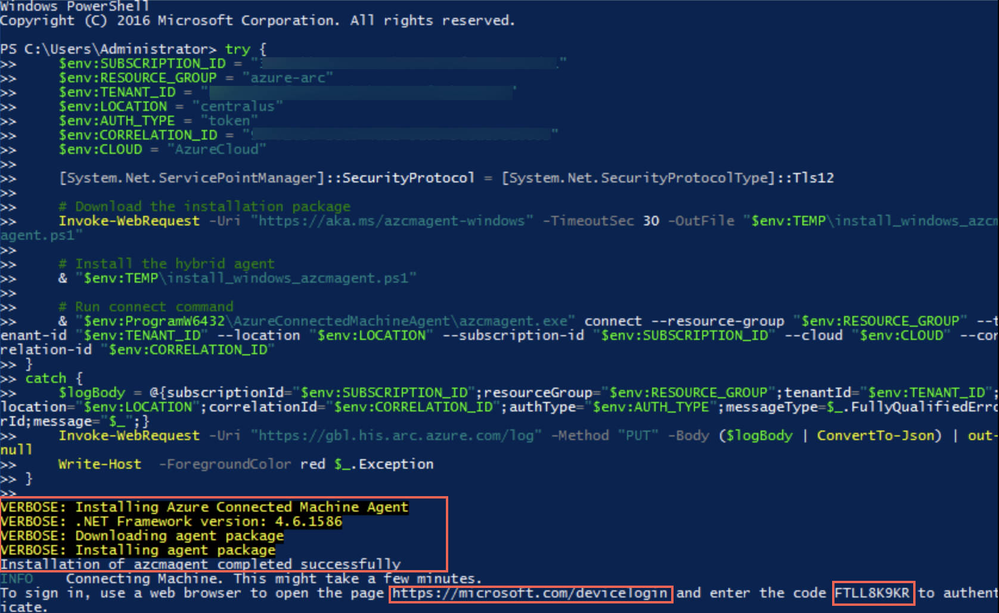

# HOL 3: Run apps and workloads anywhere with Azure cloud services.

### Exercise 1: Onboard On-prem servers to Azure Arc enabled server

1. If you are not logged in already, click on Azure portal shortcut that is available on the desktop and log in with below Azure credentials.
    * Azure Username/Email: <inject key="AzureAdUserEmail"></inject> 
    * Azure Password: <inject key="AzureAdUserPassword"></inject>

1. In the **search resources, services and docs bar**, type **Azure arc** and select it from suggestions, as shown below:
   
    
   
1. On the Azure Arc page, select **Servers** under **Infrastructure** and then click **+Add**.
    
    
    
1. In the Add servers with Azure Arc page, click **generate script** under **Add a single server**.

    
     
1. Under **pre-requisites** tab, just read the given data and click **Next**.     

    
    
1. Under **Resource details** tab, fill the following details:
     
   - Subscription: **Select your subscription**
    
   - Resource group: **azure-arc (1)**
  
   - Region: **Central US (2)**
   
   - Operating system: **Windows (3)**
   
   - Leave other values as default and Click **Next (4)**

    

1. Under **Tags** tab, leave the values as default and click **Next**.

1. Under **Download and script** tab, copy the entire script and paste it in a notepad as it will be used in the further steps and then click **Close**.

    
    
1. Go to **Start** button in the VM, search for **Hyper-V Manager** there and select it. 

    

   > You can also open the **Hyper-V manager** by clicking on the icon that is present in the taskbar. 
    
1. In Hyper-V Manager, select **SMARTHOST<inject key="DeploymentID" enableCopy="false" />**. 
  
    
    
1. In Hyper-V Manager, select the **AzureMigrateAppliance** VM, then select **Start** on the right if not already running.

        
    
1. In Hyper-V Manager, select the **AzureMigrateAppliance** VM, then select **Connect** on the right.

      
    
1. Under Connect to AzureMigrateAppliance, click **Connect** and then log into the VM with the **Administrator password**: **<inject key="SmartHotelHost Admin Password" />** (the login screen may pick up your local keyboard mapping, use the 'eyeball' icon to check).
 
    
    
1. From the **start** menu of the AzureMigrateAppliance VM, search for **powershell** and open it.

    
      
1. In powershell, run the whole script that you copied in the notepad earlier in step 12.

1. After running the script, packages will be installed and a code will be generated for authentication purpose.
     - Use the code and follow the instruction to finish the login.
   
   > **Note:** You need to login in and be authenticated to use the `Azure Connected Machine Agent`.
        After copy the __code__ and go to the link in the VM's browser, [https://microsoft.com/devicelogin](https://microsoft.com/devicelogin). 
    
    
     
 1. Close the AzureMigrateAppliance VM, and go back to Azure portal and verify that a server is now added to Azure Arc successfully.
    
    
     
    
     
