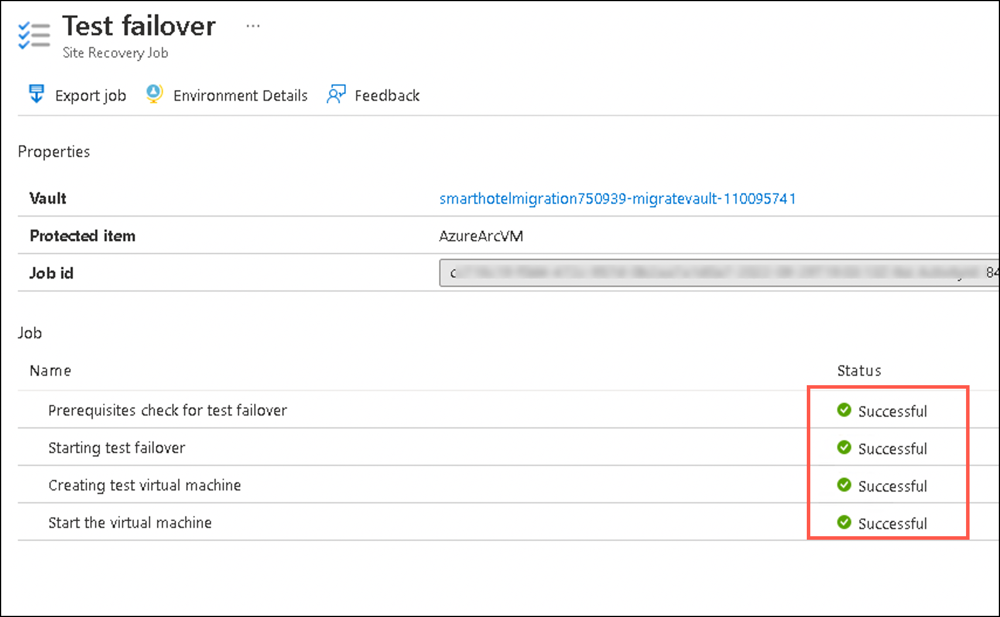

## HOL3: Exercise 3: Setup test failover

In this exercise, you will deploy a Test Failover to the replicated Virtual Machine which allows you to test the sanity of the virtualized workload without interrupting your production workload or ongoing replication.

1. If you are not logged in already, click on Azure portal shortcut that is available on the desktop and log in with below Azure credentials.
    * Azure Username/Email: <inject key="AzureAdUserEmail"></inject> 
    * Azure Password: <inject key="AzureAdUserPassword"></inject>

1. In the **search resources, services and docs bar**, type **Recovery service vaults** and select it from suggestions, as shown below:
   
    
    
1. Under Recovery service vaults, click on **SmartHotelMigration<inject key="DeploymentID" enableCopy="false" />-MigrateVault-_xxxx_** which we have configured in the previous HOL1 task.  

    
    
1. On the **Recovery Service Vault page**, click on **Replicated Items (1)** under **Protected Items** and select **AzureArcVM (2)** that you replicated in the previous exercise.     

     
   
1. On the **AzureArcVM** page, click on **Test Failover**.  

     
   
1. On the **Test failover page**, select the Azure virtual network: **SmartHotelVNet (1)** and click on **Ok (2)**.

     
    
1. Go back to the Replicated items page and select **Site Recovery Jobs (1)** under **Monitoring** from the left-hand side panel and click on **Test Failover (2)** to view the job status.  

     

1. Wait for 10-15 minutes, for the job status of the test failover to get completed successfully.

     
  
1. In the **search resources, services and docs bar**, type **Virtual Machines** and select it from suggestions.

1. Under **Virtual Machines** page, select the **AzureArcVM-test** which is automatically created after test failover.

     
  
1. On the **smarthotelweb1-test page**, verify that the status of the VM is in **Running state (1)** and also you are able to **Connect it through RDP (2)**.  

     

**Summary:** In this exercise, you explored that how can one validate the replication and disaster recovery strategy by testing a failover, that too without any data loss or downtime.
