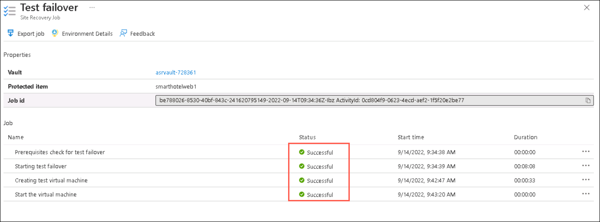
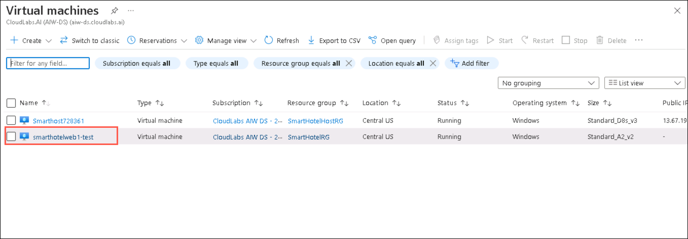

### HOL3: Exercise 3: Setup test failover

1. If you are not logged in already, click on Azure portal shortcut that is available on the desktop and log in with below Azure credentials.
    * Azure Username/Email: <inject key="AzureAdUserEmail"></inject> 
    * Azure Password: <inject key="AzureAdUserPassword"></inject>

1. In the **search resources, services and docs bar**, type **Recovery service vaults** and select it from suggestions, as shown below:
   
    
    
1. Select the Recovery service vault that you created in the previous exercise.    
    
1. On the **Recovery Service Vault page**, click **Replicated Items (1)** under **Protected Items** and select **smartholweb1** that you replicated in the previous exercise.     

    
   
1. On the **smarthotelweb1** page, click on **Test Failover**.  

    
   
1. On the **Test failover page**, select the Azure virtual network: **SmartHotelVNet** and click **Ok**.

1. Wait for 10-15 minutes, for the job status of the test failover to get completed successfully.

   
  
1. In the **search resources, services and docs bar**, type **Virtual Machines** and select it from suggestions.

1. Under **Virtual Machines** page, select the **smarthotelweb1-test** which is automatically created after test failover.

   
  
1. On the **smarthotelweb1-test page**, verify that the status of the VM is in **Running state (1)** and also you are to **Connect it through RDP (2)**.  

   
