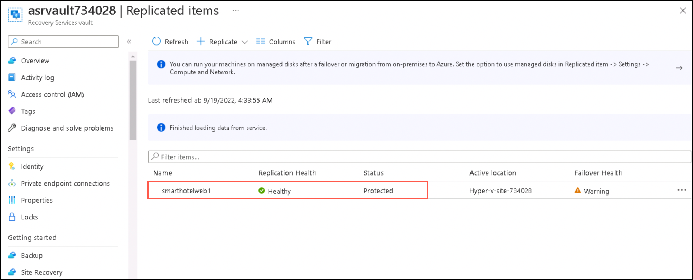
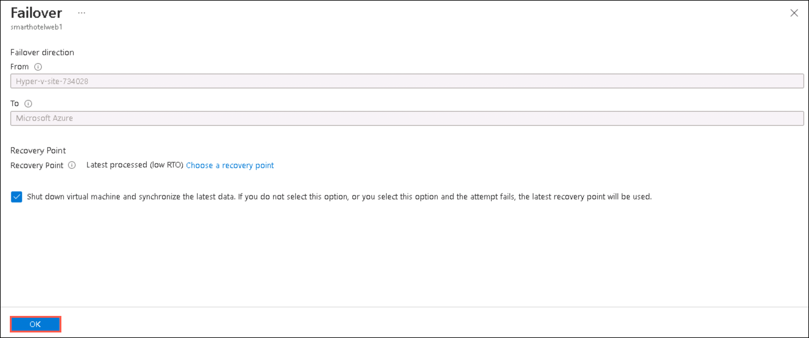
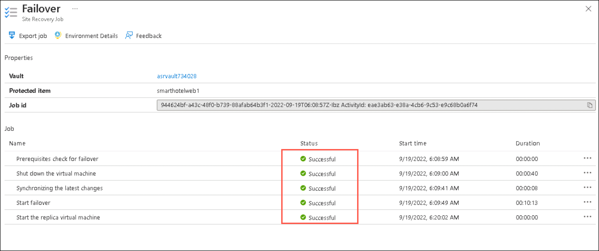
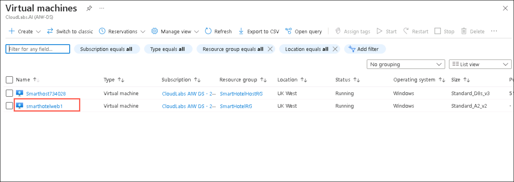
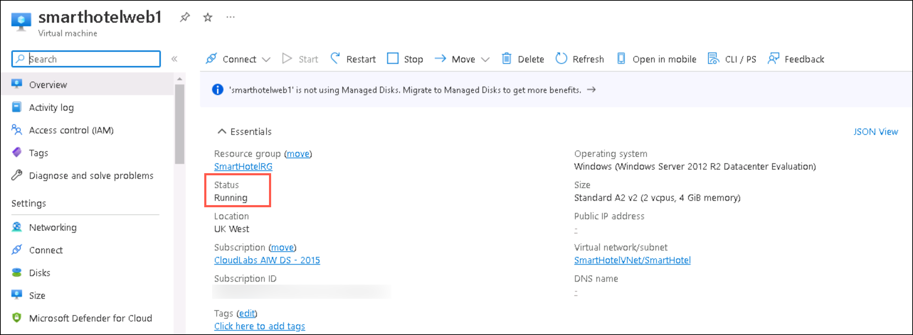

### HOL3: Exercise 4: Failover the infrastructure to Azure Cloud.

In this exercise, you will deploy the Failover from on-premises to Azure. After setting up replication to Azure for on-premises machines, when your on-premises site goes down, you fail those machines over to Azure. After failover, Azure VMs are created from replicated data.

1. If you are not logged in already, click on Azure portal shortcut that is available on the desktop and log in with below Azure credentials.
    * Azure Username/Email: <inject key="AzureAdUserEmail"></inject> 
    * Azure Password: <inject key="AzureAdUserPassword"></inject>

1. In the **search resources, services and docs bar**, type **Recovery service vaults** and select it from suggestions, as shown below:
   
   
    
1. Select the Recovery service vault that you created in the previous exercise.    
    
1. On the **Recovery Service Vault page**, click **Replicated Items (1)** under **Protected Items** and select **smartholweb1 (2)** that you replicated in the previous exercise.     

    
   
1. On the **smarthotelweb1** page, click on **Failover**.

    
   
1. On the **Failover** page, review the settings and click **Ok**.  

    
   
1. You can follow failover progress on the **Jobs** page.    

    
   
1. After the Failover is completed successfully, the **active location** of the **replicated smarthotelweb1** will be changed to **Microsoft Azure**.

     
   
   > **Note:** If you want to switch to different recovery point to use for the failover, use **Change recovery point**.   
  
    
   
1. On the **replicated smarthotelweb1** page, click on **Commit** to commit the failover (The Commit action deletes all the recovery points available with the service). 

   
   
1. On the **Commit** page, click **Ok**.   

    
   
1. After the Failover is **committed successfully**, go to the **search resources, services and docs bar**, type **Virtual Machines** and select it from suggestions.   

1. Under **Virtual Machines** page, select the **smarthotelweb1** which is automatically created from replicated data after a Failover.

     
   
1. On the **smarthotelweb1** page, verify that the status of the VM is in **Running state**. 

      
