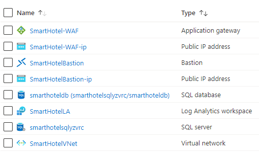

# Landing zone creation using ARM template

## Requirements

1. You will need Owner or Contributor permissions for an Azure subscription to use in the lab.

2. Your subscription must have sufficient unused quota to deploy the VMs used in this lab. To check your quota:

    - Log in to the Azure portal, select **All services** then **Subscriptions**. Select your subscription, then choose **Usage + quotas**.
  
    - From the **Select a provider** drop-down, select **Microsoft.Compute**.
  
    - From the **All service quotas** drop down, select **Standard DSv3 Family vCPUs**, **Standard FSv2 Family vCPUs** and **Total Regional vCPUs**.
  
    - From the **All locations** drop down, select the location where you will deploy the lab.
  
    - From the last drop-down, select **Show all**.
  
    - Check that the selected quotas have sufficient unused capacity:
  
        - Standard DSv3 Family vCPUs: **at least 8 vCPUs**.
  
        - Standard FSv2 Family vCPUs: **at least 6 vCPUs**.

        - Total Regional vCPUs: **at least 14 vCPUs**.

    > **Note:** If you are using an Azure Pass subscription, you may not meet the vCPU quotas above. In this case, you can still complete the lab, by taking the following steps:

### Task 1: Deploy the landing zone

1. You can deploy the template by selecting the **Deploy to Azure** button below. You will need to create a new resource group. The suggested resource group base name (prefix) to use is **SmartHotel**. You will also need to select a location close to you to deploy the template to. Then choose **Review + create** followed by **Create**. 

     
  
2.  Deploy the below template by selecting the **Deploy to Azure** button. Create a resource group with the base name (prefix) to use is **SmartHotelHost**. You will also need to select a location close to you to deploy the template to. Then choose **Review + create** followed by **Create**. 

     

   
   > **Note:** The template will take around 40 minutes to deploy. 

### Task 2: Verify the on-premises environment

1. Navigate to the **SmartHotelHost** VM that was deployed by the template in the previous step.

2. Make a note of the public IP address.

3. Open a browser tab and navigate to **http://\<SmartHotelHostIP-Address\>**. You should see the SmartHotel application, which is running on nested VMs within Hyper-V on the SmartHotelHost. (The application doesn't do much: you can refresh the page to see the list of guests or select 'CheckIn' or 'CheckOut' to toggle their status.)

    

    
    > **Note:** If the SmartHotel application is not shown, wait 10 minutes and try again. It takes **at least 40 minutes** from the start of template deployment. You can also check the CPU, network, and disk activity levels for the SmartHotelHost VM in the Azure portal, to see if the provisioning is still active.
    

### Task 3: Verify the landing zone environment

1. Navigate to the **SmartHotelRG** resource group.
 
2. Note the Virtual Network, Bastion resource, Application Gateway, and SQL Server are available.

     
    
