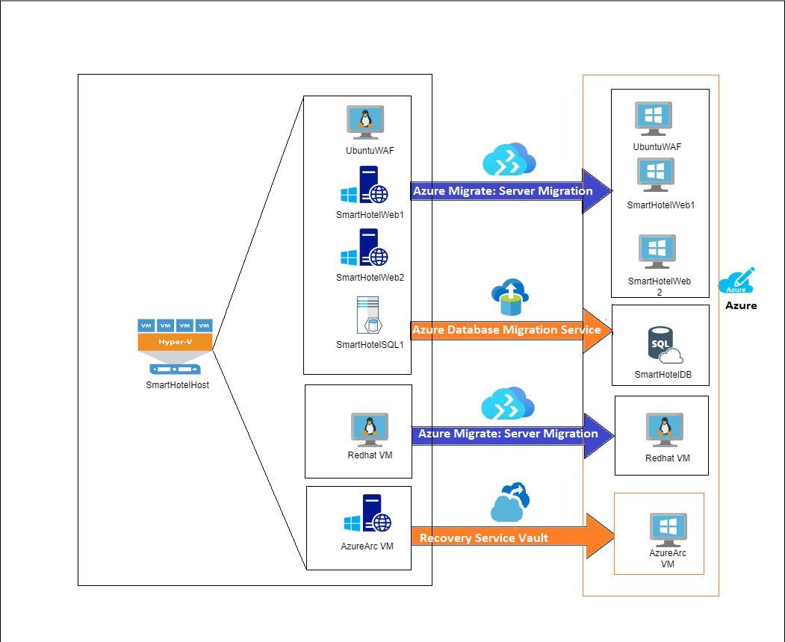

# Discover and Assess Windows & SQL Servers

## Hands-on Labs Scenario

The following labs provide you with a quick and easy way to get started with Azure Migrate through on-premises environments that do not require any complex set-up or installations. 

For the purposes of these HOLs, let’s consider that SmartHotel is a large hotel company. 

Their IT systems run Windows, Linux, SQL Servers, and MySQL across on-premises data centers, distribution centers, and multiple public clouds. This poses operational challenges for SmartHotel. They’d like a consistent way to govern and operate across these disparate environments, ensure security across the entire organization, and enable innovation and developer agility, all while meeting regulatory and compliance requirements and being able to leverage the latest innovations of database technologies.

## Lab Context

SmartHotel wants to migrate and modernize some of their servers and databases to cloud. They would like to reduce the management overhead and stay current with the evergreen versions of SQL Server with the help of Azure SQL Server. However, they also want to secure their rest on-premises server from any disaster as they have faced some disaster in the past where the on-premises databases were got corrupted. So, SmartHotel wants to use the Azure Site Recovery and wanted to secure the servers from any disaster. They would also like to get the benefits of disaster recovery, Automanage, Optimize the workloads and the security with the help of Microsoft Defender for Cloud.

Let’s take the journey together with SmartHotel and see how easy it is to accomplish all the above with Azure Migrate, DMS, and with Azure Site Recovery.

In this lab, you will leverage Azure Migrate and DMS to migrate and modernize the on-premises servers and databases to Azure cloud.

In **hands on lab 1: Migrating Windows & SQL Server workloads**, you will evaluate the on-premises environment using Azure Migrate, choosing Azure Migrate tools, setting up the Azure Migrate appliance in an on-premises environment, doing a migration evaluation, and utilising the dependency visualisation, develop a migration assessment for the SmartHotel application using Azure Migrate, register your LabVM Hyper-V host with the Migration and Modernization service in this activity. Azure Site Recovery serves as the foundational migration engine for this service. You will install the Azure Site Recovery Provider on your Hyper-V server as part of the registration procedure.
## Solution architecture

The SmartHotel application comprises 7 VMs hosted in Hyper-V:

- **Database tier** Hosted on the smarthotelSQL1 VM, which is running Windows Server 2016 and SQL Server 2017.

- **Application tier** Hosted on the smarthotelweb2 VM, which is running Windows Server 2012R2.

- **Web tier** Hosted on the smarthotelweb1 VM, which is running Windows Server 2012R2.

- **Web proxy** Hosted on the UbuntuWAF VM, which is running Nginx on Ubuntu 18.04 LTS.

- **Linux web server and OSS DB** Hosted on the Redhat VM, which is running on Red hat enterprise server 8.3. 

For simplicity, there is no redundancy in any of the tiers.

>**Note:** For convenience, the Hyper-V host itself is deployed as an Azure VM. For the purposes of the lab, you should think of it as an on-premises machine.

Throughout this lab, you will use Azure Migrate as your primary tool for discovery and assessment. Discovery and assessment tool uses a lightweight Azure Migrate appliance. The appliance completes server discovery and sends server configuration and performance metadata to Azure Migrate, as detailed below.

To assess the Hyper-V environment, you will use Azure Migrate: Server Assessment. This includes deploying the Azure Migrate appliance on the Hyper-V host to gather information about the environment. For deeper analysis, the Microsoft Monitoring Agent and Dependency Agent will be installed on the VMs, enabling the Azure Migrate dependency visualization.

The application, web, and web proxy tiers will be migrated to Azure VMs using Azure Migrate: Server Migration. You will walk through the steps of building the Azure environment, replicating data to Azure, customizing VM settings, and performing a failover to migrate the application to Azure.
