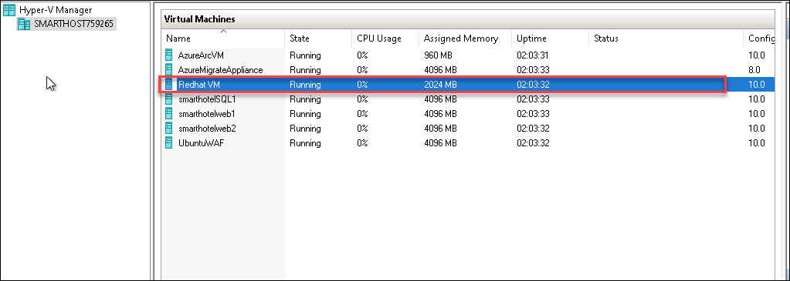
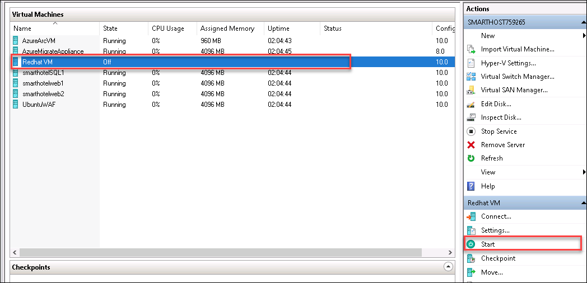
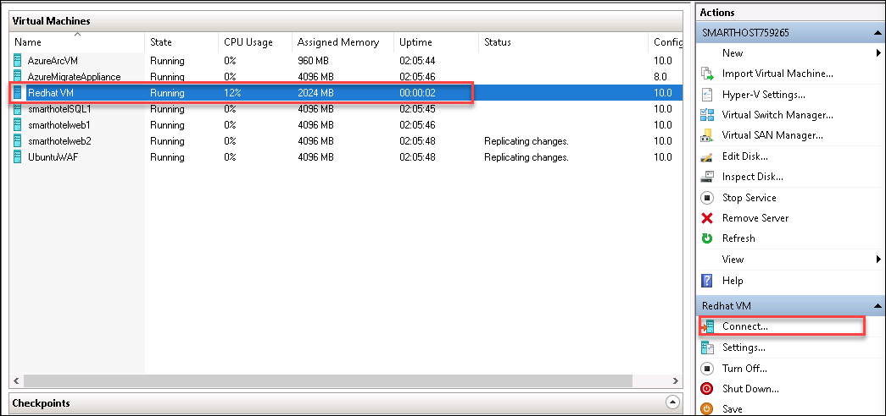
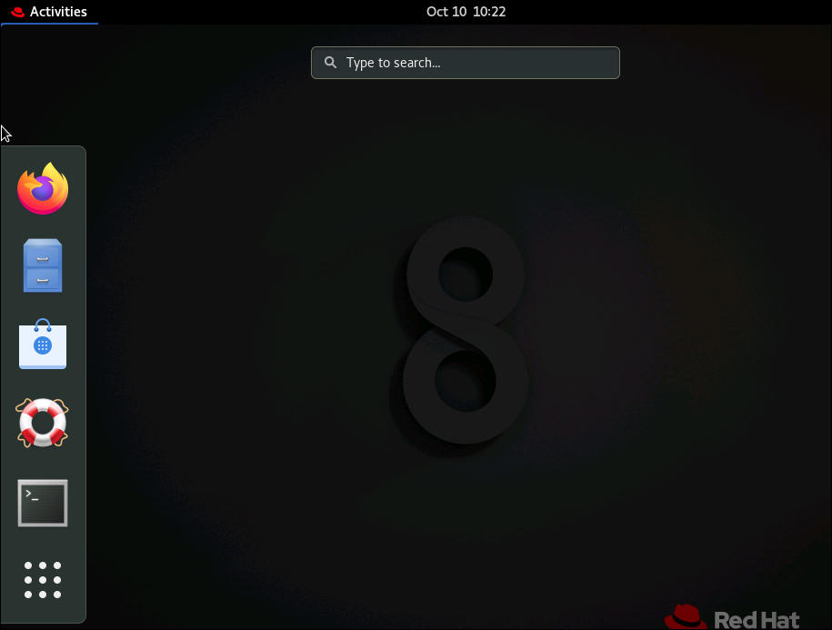

# HOL 2: Migrate and modernize Linux & OSS DB workloads to Azure

In this Module, you will use Azure Migrate: Server Assessment to assess the on-premises environment. This will include selecting Azure Migrate tools, deploying the Azure Migrate appliance into the on-premises environment, creating a migration assessment, and using the Azure Migrate dependency visualization.

### Exercise 1: Discovery, Assess, and Plan: Evaluate your current environment

In this exercise, you will review the already discovered server on your Azure Migrate project.

#### Task 1: Review the already discovered and Assessed environment in Azure migrate

1. If you are not logged in already, click on Azure portal shortcut that is available on the desktop and log in with below Azure credentials.
    * Azure Username/Email: <inject key="AzureAdUserEmail"></inject> 
    * Azure Password: <inject key="AzureAdUserPassword"></inject>

2. Click on **Show Portal Menu (1)** bar and select **All services (2)** in the portal's left navigation.
 
    

3. In the search bar, search for **Azure Migrate** and select it from the suggestions to open the Azure Migrate Overview blade, as shown below. 
 
    

4. Under **Azure Migrate: Discovery and assessment**, you'll see 7 discovered servers. We have already migrated 3 severs in the previous HOL and now we will be migrating and modernizing the redhat and OSS DB in this HOL
 
    
 
#### Task 2: Review your on-prem Hyper-V Linux Server and OSS DB.
 
1. Go to **Start** button in the VM, search for **Hyper-V Manager** there and select it. 

   > You can also open the **Hyper-v manager** by clicking on the icon that is present in the taskbar. 

     
     
1. In Hyper-V Manager, select **SMARTHOST<inject key="DeploymentID" enableCopy="false" />**. You should now see the Redhat VM and 6 other VMs that we are going to use in other HOLs.

     
     
1. In Hyper-V Manager, select the **RedHat VM**, then select **Start** on the right if not already running.

   

1. In Hyper-V Manager, select the **Redhat VM**, then select **Connect** on the right.

    

1. Log into the VM with the **Administrator password**: **<inject key="SmartHotelHost Admin Password" />** (the login screen may pick up your local keyboard mapping, use the 'eyeball' icon to check).

1. You should be able to login to your on-prem Redhat server hosted on hyper-V. 

    

1. In the next exercise you will be migrating the Redhat server, and the OSS Database hosted in the Red hat VM to the Azure with the help of Azure Migrate.  
    

**Summary:** In this exercise, you explored how Assessments work to migrate your on-premises servers to Azure virtual machines. You learnt how to assess your on-premises servers Hyper-V environment, and physical servers for migration to Azure VMs.
