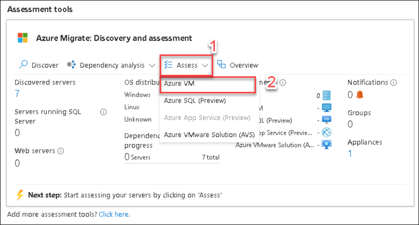
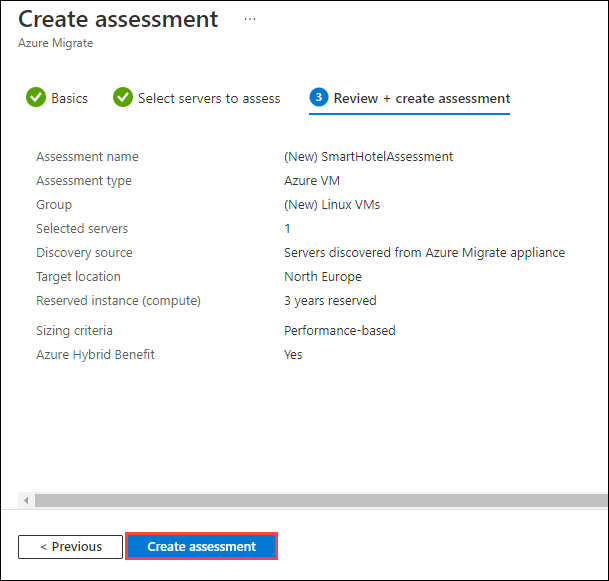
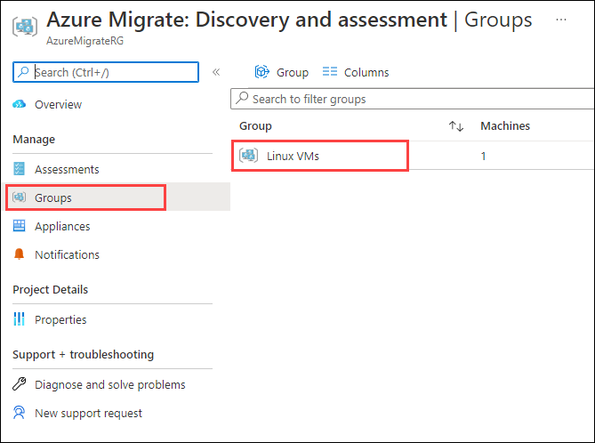
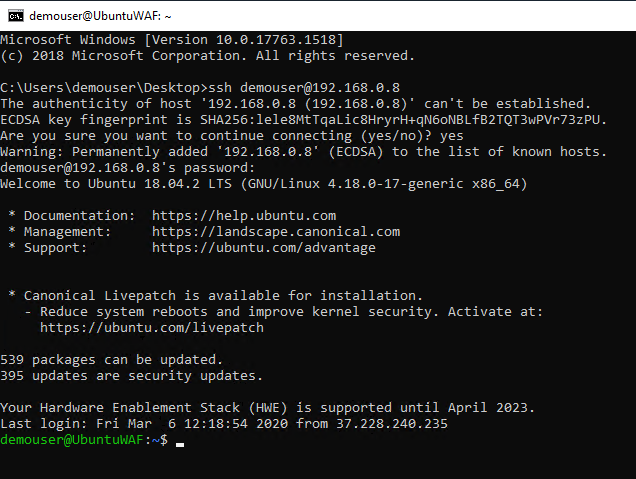

## HOL2: Exercise 2: Set up your environment on Azure to migrate servers

In this HOL, you will learn how to migrate machines as physical servers to Azure, using the Azure Migrate: Server Migration tool. Migrating machines by treating them as physical servers is useful in a number of scenarios such as, Migrate on-premises physical servers, Migrate Hyper-V VMs and much more.

### Task 1: Create a migration assessment

In this task, you will use Azure Migrate to create a migration assessment for the SmartHotel application, using the data gathered during the discovery phase.

1. Select **Assess** under **Azure Migrate: Discovery and assessment** and click on **Azure VM** to start a new migration assessment.

   

2. On the Assess servers blade, ensure the Assessment type to be **Azure VM** and Discovery Source to be **Servers discovered from Migrate Appliance**. Under **Assessment settings**, select **Edit**.

   

3. The **Assessment settings** blade allows you to tailor many of the settings used when making a migration assessment report. Take a few moments to explore the wide range of assessment properties. Hover over the information icons to see more details on each setting. Choose any settings you like, then select **Save**. (You have to make a change for the Save button to be enabled; if you don't want to make any changes, just close the blade.)

   

4. Select **Next** to move to the **Select servers to assess** tab and enter the following information:
     
     1. Assessment name: Enter **SmartHotelAssessment** 
     1. Select or create a group: Choose **Create New** and enter the 
     1. Group name: Enter **Linux VMs**.
     1. Add machines to the Group:  Select **LinuxVM** from dropdown.
     1. Select the **RedHatVM** VMs and
     1.  Click on **Next**.

   

5. Click on **Create assessment** to create the assessment. 

   

6. On the **Servers, databases and web apps** blade, select **Refresh** periodically until the number of assessments shown is **1** (This may take few minutes). Once the assessments count is updated, click on **1** that is next to **Total** under **Assessments**.  

    ")
    
7. Select **Assessments** under **Azure Migrate: Discovery and assessment** to see a list of assessments. Then select the actual assessment.

   ")

### Task 2: Configure dependency visualization

When migrating a workload to Azure, it is important to understand all workload dependencies. A broken dependency could mean that the application doesn't run properly in Azure, perhaps in hard-to-detect ways. Some dependencies, such as those between application tiers, are obvious. Other dependencies, such as DNS lookups, Kerberos ticket validation or certificate revocation checks, are not.

In this task, you will configure the Azure Migrate dependency visualization feature. This requires you to first create a Log Analytics workspace, and then to deploy agents on the to-be-migrated VMs.

1. Return to the **Azure Migrate** blade in the Azure Portal, select **Servers, databases and web apps (1)**. Under **Discovery and assessment** select **Groups (2)**,

       

2. Select the **Linux VMs** group to see the group details. 

      

3. Note that each VM has their **Dependencies** status as **Requires agent installation**. Select **Requires agent installation** for the **UbuntuVM** VM.

   

4. On the **Dependencies** blade, select **Configure Log Analytics workspace**.

   

5. On the **Configure Log Analytics workspace** blade, provide the below information and select **Configure**.

   - Log Analytics workspace: Click on **Create new** and enter **AzureMigrateWS<inject key="DeploymentID" enableCopy="false" />**
   - Log Analytics workspace location: Select **East US** from the dropdown.

  

6. Wait for the workspace to be deployed. Once it is deployed, navigate to **AzureMigrateWS<inject key="DeploymentID" enableCopy="false" />** by clicking on it.

   

7. Select **Agents management** under **Settings** from the left-hand side menu. Make a note of the **Workspace ID** and **Primary Key** (for example by using Notepad).

   

8. You will now deploy the Linux versions of the Microsoft Monitoring Agent and Dependency Agent on the **UbuntuVM** VM. To do so, you will first connect to the UbuntuWAF remotely using an SSH session.

9. Open a command prompt using the desktop shortcut.  

10. Enter the following command to connect to the **RedhatVM** VM running in Hyper-V on the SmartHotelHost:

    ```bash
    ssh Administrator@192.168.1.18
    ```

11. Enter 'yes' when prompted whether to connect. Use the password **<inject key="SmartHotelHost Admin Password" />**.

    

12. Enter the following command, followed by the password **<inject key="SmartHotelHost Admin Password" />** when prompted:
  
    ```
    sudo -s
    ```

    > This gives the terminal session elevated privileges.

13. Enter the following command, substituting \<Workspace ID\> and \<Workspace Key\> with the values copied previously. Answer **Yes** when prompted to restart services during package upgrades without asking.  

    ```
    wget https://raw.githubusercontent.com/Microsoft/OMS-Agent-for-Linux/master/installer/scripts/onboard_agent.sh && sh onboard_agent.sh -w <Workspace ID> -s <Workspace Key>
    ```

14. Enter the following command, substituting \<Workspace ID\> with the value copied earlier:

    ```s
    /opt/microsoft/omsagent/bin/service_control restart <Workspace ID>
    ```

15. Enter the following command. This downloads a script that will install the Dependency Agent.

    ```s
    wget --content-disposition https://aka.ms/dependencyagentlinux -O InstallDependencyAgent-Linux64.bin
    ```

16. Install the dependency agent by running the script download in the previous step.

    ```s
    sh InstallDependencyAgent-Linux64.bin -s
    ```

    
    

17. Return to the Azure Portal and refresh the Azure Migrate **SmartHotel VMs** VM group blade. The 3 VMs on which the dependency agent was installed should now show their status as **Installed**. (If not, refresh the page **using the browser refresh button**, not the refresh button in the blade.  It may take up to **5 minutes** after installation for the status to be updated.)

     
   
   >**Note**: If you notice that the dependency agent status is showing as **Requires Agent Installation** instead of Installed even after installing dependency agents in all the three VMs, please follow the steps from [here](https://github.com/CloudLabsAI-Azure/Know-Before-You-Go/blob/main/AIW-KBYG/AIW-Infrastructure-Migration.md#4-exercise1---task6---step1) to confirm dependency agent installation in VMs using Log Analytics workspace.
 
18. Select **View dependencies**.

   
   
19. Take a few minutes to explore the dependencies view. Expand each server to show the processes running on that server. Select a process to see process information. See which connections each server makes.

    
 
#### Task summary 

In this task you configured the Azure Migrate dependency visualization feature, by creating a Log Analytics workspace and deploying the Azure Monitoring Agent and Dependency Agent on Linux on-premises machine.
