## HOL2: Exercise 3: Migrating your apps and your data, leveraging Microsoft services and tools like Azure Migrate, the Azure Hybrid Benefit, and other tools and programs. 

### Task 1: Register the Hyper-V Host with Migration and modernization

In this task, you will review the already registered Hyper-V host(LabVM) with the Migration and modernization service. This service uses Azure Site Recovery as the underlying migration engine. As part of the registration process, we have already deployed the Azure Site Recovery Provider on your Hyper-V host in HOL1 and we will be using the same here as well.

1. Return to the **Azure Migrate** blade in the Azure Portal, and select **Servers, databases and web apps** under **Migration goals** on the left. 

2. Now under Migration and modernization, you should be able to see 7 discovered server. Now click on the **Discovered server** to view all the server that has been discovered with the help of Azure Migrate. 

    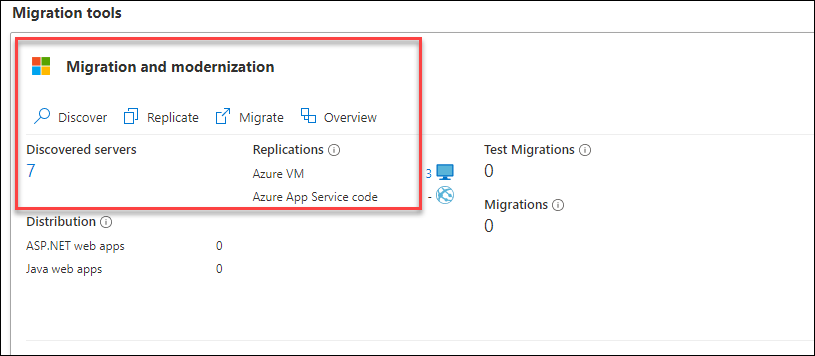

3. In the discovered list, you'll see the **redhat**, we will be replicating this redhat VM in the next task with the help of Azure Migrate.

    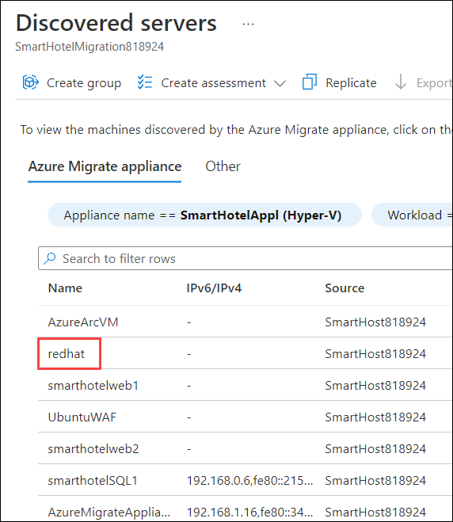

#### Task summary 

In this task you get a overview of your registered Hyper-V host with the Azure Migrate Server Migration service.

### Task 2: Enable Replication from Hyper-V to Azure Migrate

In this task, you will configure and enable the replication of your on-premises virtual machine from Hyper-V to the Azure Migrate Server Migration service.

1. Return to the Azure Migrate | Servers, databases and web apps blade and under **Migration and modernization**, select **Replicate**. This opens the **Replicate** wizard.

    
   
1. Under **Specific Intent** page, provide the below details:

    -  What do you want to migrate? : Select **Servers or Virtual machines (VM)** **(1)**
    -  Where do you want to migrate to? : Select **Azure VM** **(2)**
    -  Click on **Continue (3)**

    

2. In the **Basics settings** tab, under **Are your machines virtualized?**, select **Yes, with Hyper-V** from the drop-down. Then select **Next**.

    

3. In the **Virtual machines** tab, under **Import migration settings from an assessment**, select **Yes, apply migration settings from an Azure Migrate assessment (1)**. Select the **SmartHotel VMs (2)** VM group and the **SmartHotelAssessment (3)** migration assessment.

    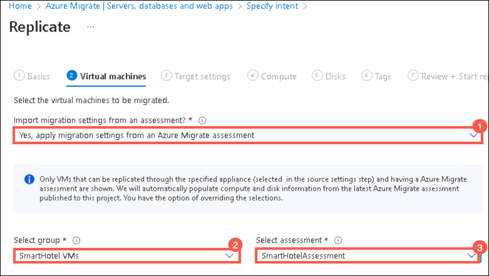

4. The **Virtual machines** tab should now show the virtual machines included in the assessment. Select the **redhat (1)** virtual machine, then select **Next (2)**.

    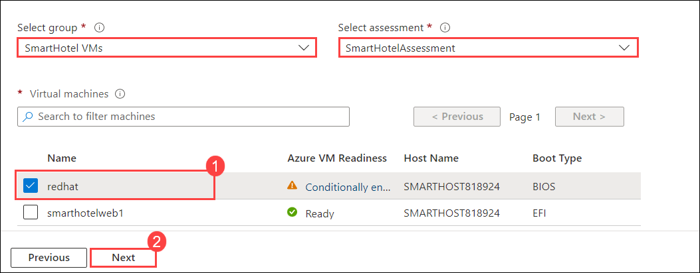

5. On the **Target settings** tab, select the below information,
   - Select your subscription and the existing **SmartHotelRG (1)** resource group. 
   - **Cache storage account**: Select the **(Auto-created)** storage account that has been created in the previous HOL1 **(2)**.
   - **Virtual Network**: Select **SmartHotelVNet (3)**. 
   - **Subnet**: Select **SmartHotel (4)**. 
   - Select **Next (5)**.
 
 
    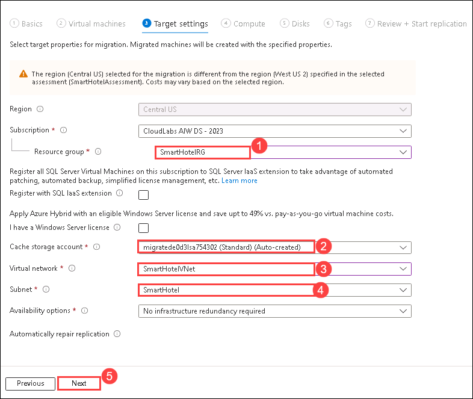

 > **Note:** For simplicity, in this lab you will not configure the migrated VM for high availability, since each application tier is implemented using a single VM.

6. On the **Compute** tab, select the below configuration,
   - Select the **Standard_F2s_v2** VM size for each virtual machine. 
   - Select the **Linux** operating system for the **redhat** virtual machine. 
   - Select **Next**. 


    
    

7. In the **Disks** tab, review the settings but do not make any changes. Select **Next: Tags**, then select **Replicate** to start the server replication.

8. In the **Azure Migrate - Servers, databases and web apps** blade, under **Migration and modernization**, select the **Overview** button.

    
    
9. Confirm that the 1 machine is replicating.

    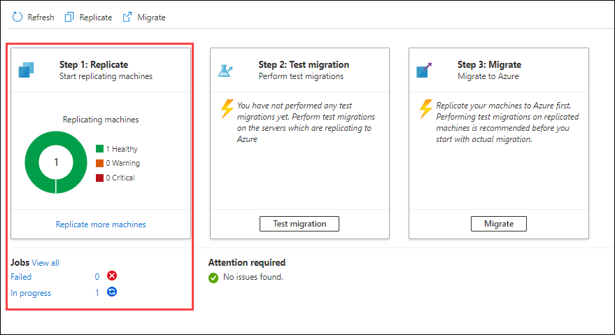

10. Select **Replicating Machines (1)** under **Manage** on the left. Select **Refresh (2)** occasionally and wait until the redhat machine has a **Protected (3)** status, which shows the initial replication is complete. This will take 5-10 minutes.

    


#### Task summary 

In this task you enabled replication from the Hyper-V host to Azure Migrate, and configured the replicated VM size in Azure.

### Task 3: Configure Networking

In this task you will modify the settings for each replicated VM to use a static private IP address that matches the on-premises IP addresses for that machine.

1. Still using the **Migration and modernization - Replicating machines** blade, select the **redhat** virtual machine. This opens a detailed migration and replication blade for this machine. Take a moment to study this information.

    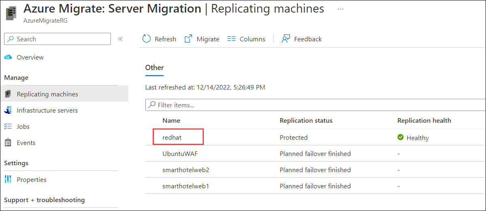

2. Select **Compute and Network (1)** under **General** on the left, then select **Edit (2)**.

    

3. Confirm that the VM is configured to use the **F2s_v2** VM size.

4. Under **Network Interfaces**, select **AzureMigrateSwitch** to open the network interface settings.

    

5. Change the **Private IP address** to **192.168.0.19**

    

6. Select **OK** to close the network interface settings blade, then **Save** the **redhat** settings to configure the private IP address for the VM.


#### Task summary 

In this task you modified the settings for each replicated VM to use a static private IP address that matches the on-premises IP addresses for that machine

> **Note**: Azure Migrate makes a "best guess" at the VM settings, but you have full control over the settings of migrated items. In this case, setting a static private IP address ensures the virtual machine in Azure retain the same IPs they had on-premises, which avoids having to reconfigure the VM during migration (for example, by editing web.config files).


### Task 4: Server migration

In this task you will perform a migration of the redhat virtual machine to Azure.

> **Note**: In a real-world scenario, you would perform a test migration before the final migration. To save time, you will skip the test migration in this lab. The test migration process is very similar to the final migration.

1. Return to the **Migration and modernization** overview blade. Under **Step 3: Migrate**, select **Migrate more servers**.

    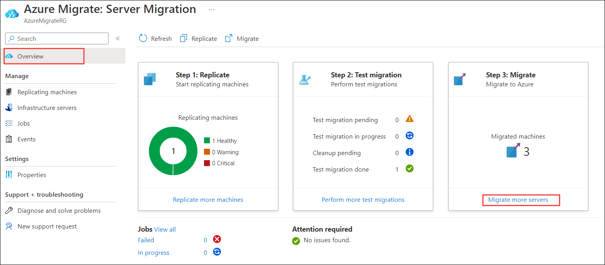

2. On the **Migrate** blade, select **yes (1)** for **Shutdown machines before migration to minimum data loss** and select the **redhat (2)** virtual machine then select **Migrate (3)** to start the migration process.

    

   > **Note**: You can optionally choose whether the on-premises virtual machine should be automatically shut down before migration to minimize data loss. Either setting will work for this lab.

3. The migration process will start.

    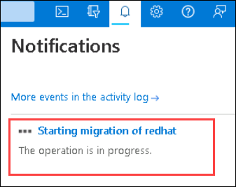

4. To monitor progress, select **Jobs (1)** under **Manage** on the left and review the status of the redhat **Planned failover (2)** job.

    

5. **Wait** until the **Planned failover** jobs show a **Status** of **Successful**. You should not need to refresh your browser. This could take up to 15 minutes.

    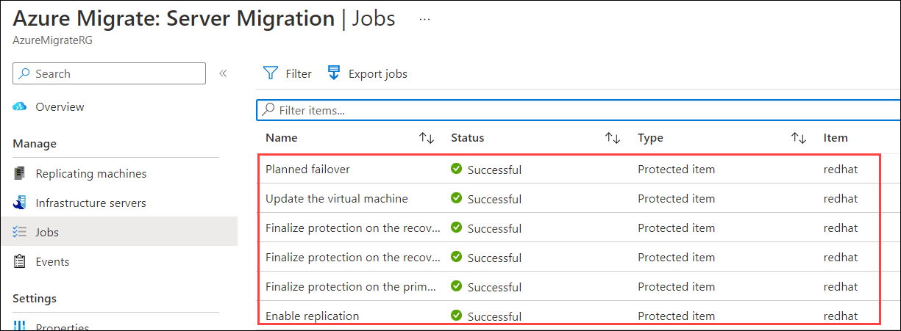

6. Navigate to the **SmartHotelRG** resource group and check that the VM, network interface, and disk resource has been created for redhat virtual machine being migrated.

    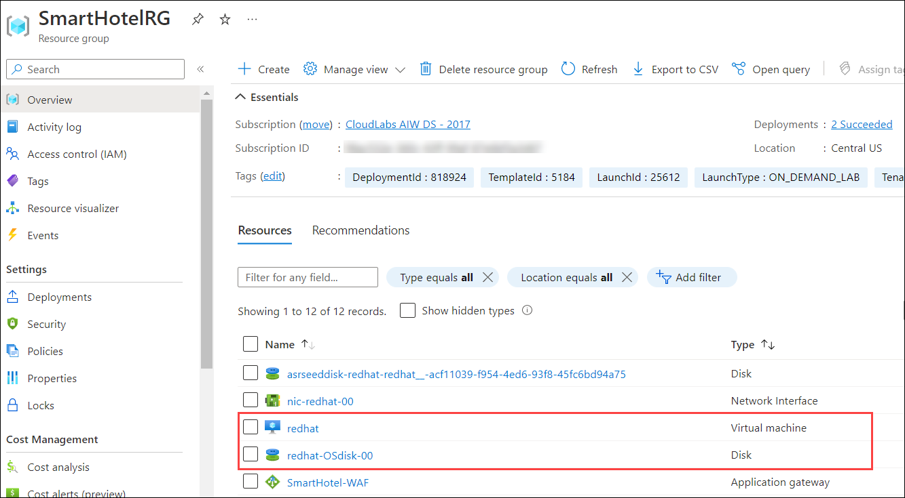

#### Task summary 

In this task you used Azure Migrate to create Azure VM using the settings you have configured, and the data replicated from the Hyper-V machine. This migrated your on-premises VM to Azure.


### Task 5: Configure the database connection

The application tier machine **redhat** is configured to connect to the application database running on-Prem.

On the migrated VM **redhat**, this configuration needs to be updated to use the Azure SQL Database instead.

1. From the Azure portal menu, which is present at the top left, click on **All services**. Select **compute** from the left-hand menu and select **Virtual machines**.

2. Click on **redhat** VM, from the overview blade, and select **Connect**. Select **Bastion** from the available options.

   **Note:** You may have to wait a few minutes and refresh to have the option to enter the credentials. 

3. **Connect** to the machine with the username **administrator** and the password <inject key="SmartHotelHost Admin Password"></inject>. When prompted, **Allow** clipboard access.

    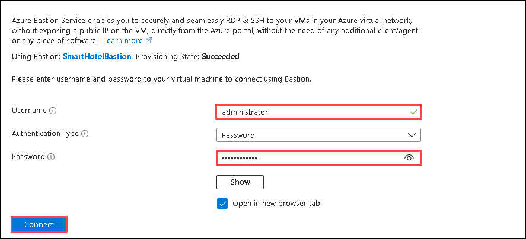

4. In the **redhat** remote desktop session, Enable the root user by running the below commands,and enter password as **demo!pass123**. 

    ```
    su 
    ```
   
5. Once you connected with the root user, navigate to the **\\etc\\www\\html\\inetpub\\SmartHotel.Registration** folder by running the below commands.
      
    *  ```  
       cd .. 
       ```
   
   
     * ```  
       cd .. 
       ```
   
     *  ```  
        cd /var/www/html/inetpub/SmartHotel.Registration
        ```

7. Run the below command to edit the **Web.config**.

    ``` 
    vim Web.config
    ```

6. Update the **DefaultConnection** setting to connect to your Azure SQL Database.

   You can find the connection string for the Azure SQL Database in the Azure portal. Navigate to the **SmartHotelRG** resource group, and then to the database **smarthoteldb** and from the overview, select **Show database connection strings**.

    

    Copy the **ADO.NET** connection string, and paste into the web.config file on **redhat**, replacing the existing connection string.  **Be careful not to overwrite the 'providerName' parameter which is specified after the connection string.**

    > **Note:** You may need to open the clipboard panel on the left-hand edge of the Bastion window, paste the connection string there, and then paste into the VM.

    Set the password in the connection string to **<inject key="SmartHotelHost Admin Password" />**.

    

6. Once done, press CTRL + [ button and press **:wq** to **Save** the `web.config` file and exit your Bastion remote desktop session.

#### Task summary 

In this task, you updated the **redhat** configuration to connect to the Azure SQL Database.

### Task 6: Configure the public IP address and test the SmartHotel application

In this task, you will associate an Application Gateway with Web Application Firewall (WAF) to replace the Ubuntu VM with the Azure managed service.

1. Navigate to the **SmartHotel-WAF** Application Gateway in the **SmartHotelRG** resource group.

1. Select **Backend pools (1)** under the Settings section, and select the **WebBackend (2)** pool.

    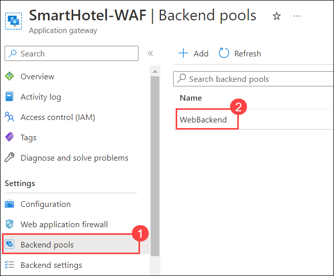

1. Set the Target type to **Virtual machine** and the Target to the NIC of **redhat**; select **Save** to update the backend pool.

    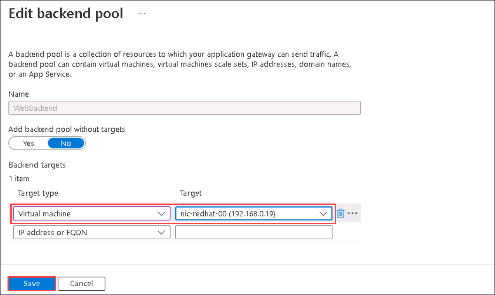

    > **Note:** This backend pool is already associated with the front-end IP address of the Application Gateway via the SmartHotelApp rule. The front-end IP, listener, rule, and backend pool were all created with the Application Gateway. This step now ties the migrated VM to the front end.
   
1. Navigate back to the **SmartHotel-WAF** Application Gateway then **Frontend IP configurations (1)** way in the Settings section, and note the IP address associated with the public IP address **appGwPublicFrontendIp (2)**.

    

1. Open a new browser tab and paste the IP address into the address bar. Verify that the SmartHotel360 application is now available in Azure.

    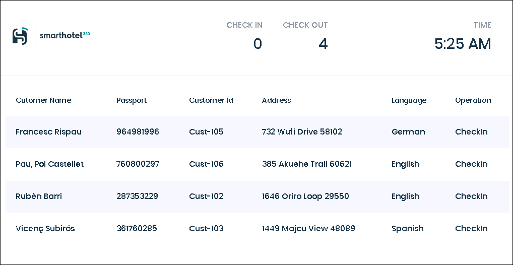
 
    > **Note**: The Check-in and Check-out might differ for you when compared to the above screenshot.

#### Task summary 

In this task, you assigned a public IP address to the UbuntuWAF VM and verified that the SmartHotel application is now working in Azure.
